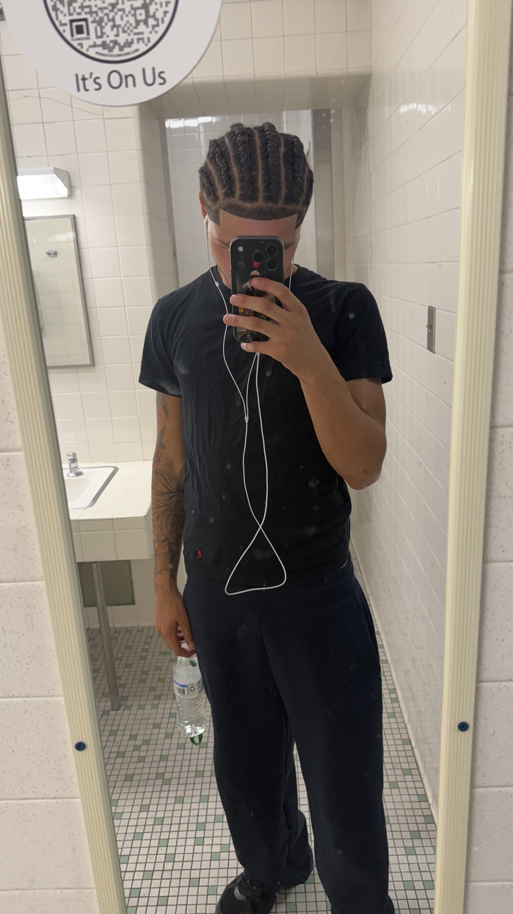

My Markdown Test  - I was not in class today, and don't really understand what I am supposed to write for this part but I am almost finished crating my website. Also it just says "This is a paragraph", but I don't really know what about. So I guess this is my "paragraph" if I am interpreting the directions right and that is what you meant.

A Subheading

Here is bold, italic, and a link.

Apples
Oranges
Lemons
Bells 
Getting to know [me](about.md)

This is Kaden Brown and he is a athlete at Albright College

[Go home](index.md)
